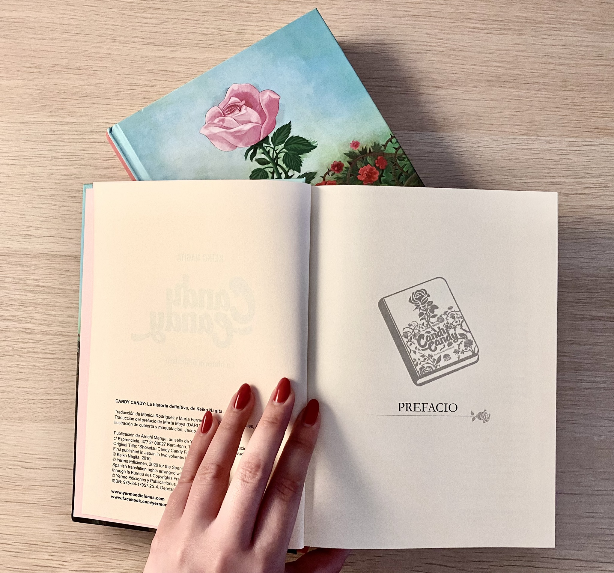

<!--
**bettysl20/bettysl20** is a ✨ _special_ ✨ repository because its `README.md` (this file) appears on your GitHub profile.

Here are some ideas to get you started:
- 🔭 I’m currently working on ...
- 🌱 I’m currently learning ...
- 👯 I’m looking to collaborate on ...
- 🤔 I’m looking for help with ...
- 💬 Ask me about ...
- 📫 How to reach me: ...
- 😄 Pronouns: ...
- ⚡ Fun fact: ...
-->

<!-- Your title -->

## Hi, I'm Beatriz, a software developer from South America.

**Glad to see you here!** :star_struck:
 
I like technology and helping to make things simple and more useful for people. Every day you learn something new, there are different ways to learn but a learning with a program, guided and in a group I think so is more fun. 😄

<!-- Your badges
You can use the website to generate badges: https://shields.io/
-->

&nbsp;

<!-- Talking about you -->

**Talking about Personal Stuffs:**

<!-- Any image aligned to the right. Beware the width -->

- 👨🏽‍💻 I’m currently working on my [Portfolio](https://github.com/bettysl20/).
- 🌱 I’m currently learning Python in a Beginner Study Group.
- 👯 I’m looking to collaborate on ...
- 🤔 I’m looking for help or improve my english.
- 💬 Ask me about programming or if you want me to be your "duck debbugging" for a moment to get out of your block, great I would like to learn from it.
- ⚡️ Fun-Fact: I like literature books, dogs and sometimes walking around my city on weekends.

&nbsp;

**Languages and Tools:**

<!-- Your github readme stats
You can use this api: https://github.com/anuraghazra/github-readme-stats
-->

  

  <!-- Your languages and tools. Be careful with the alignment. 
  You can use this sites to get logos: https://www.vectorlogo.zone or https://simpleicons.org/
  -->

<code></code>
<code></code>
<code></code>
 
<code></code>
<code></code>
<code></code>
 
<code></code>
<code></code>
 
<code></code>
<code></code>

---

<!-- Its main projects -->

<!-- This readme was created by Beatriz S- https://github.com/bettysl20 -->
